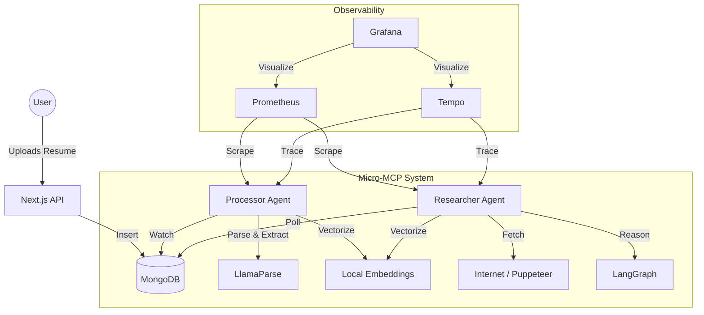

# HR Agent MCP System

This repository hosts the backend intelligence for the HR Application, built using  **Micro-MCP Servers** for performance, scalability, and observability.

## 🏗 System Architecture


The system consists of two autonomous agents (Micro-Services):

1.  **Processor Agent (`processor_server.ts`)**:
    *   **Role:** The "Reflexive" Agent.
    *   **Trigger:** Reacts immediately to new MongoDB inserts (Resume Uploads).
    *   **Capabilities:** Resume Parsing (LlamaParse), Data Extraction (Groq Llama 3), Candidate Scoring.
    *   **Port:** 3001 (MCP), 9091 (Metrics).

2.  **Researcher Agent (`research_server.ts`)**:
    *   **Role:** The "Deep Thinking" Agent.
    *   **Trigger:** Polls for processed candidates needing background checks.
    *   **Capabilities:** Deep Web Research (Puppeteer), LangGraph Reasoning, Graph Analysis.
    *   **Port:** 3002 (MCP), 9092 (Metrics).

### Why Micro-MCPs?
*   **Scalable Intelligence:** Decouples "Reflexive" (Parsing) and "Reasoning" (Research) capabilities. This allows independent scaling—e.g., running 10 lightweight Parsers vs 2 memory-heavy Researchers—and enables upgrading the "Brain" of one agent (e.g. to GPT-4) without affecting the other.
*   **Tool Locality:** The service *is* the tool. By adhering to MCP standards directly, we remove the need for a "translation layer" or API Gateway. The agents expose their capabilities natively to any MCP-compliant client.
*   **Fault Isolation:** A crash in the browser-based Researcher (e.g. a stuck tab) cannot bring down the Parsing pipeline.

### Middleware & Protocols
*   **Embedded Auth Middleware:** Each Micro-MCP server includes built-in Express middleware to validate `x-api-key` headers, securing the agentic tools directly at the source.
*   **gRPC for Telemetry:** We use **gRPC** (via OTLP) to transmit high-volume trace data to Tempo.
    *   *Rationale:* gRPC's binary, compressed format is significantly more efficient than HTTP/JSON for observability data, ensuring that logging massive amounts of "thought process" data doesn't degrade agent performance.

##  Performance Optimizations

### Embedding Model (Quantized & Baked-In)
We use `Xenova/all-MiniLM-L6-v2` for candidate vector scoring. To ensure industry-grade performance:
*   **Quantization:** We force the usage of the **8-bit quantized model** (~23MB) instead of the full version.
*   **Build-Time "Baking":** The model is downloaded during the `docker build` process (`scripts/download_model.ts`).
*   **Zero-Latency Startup:** In production, the model loads instantly from the container's local filesystem (`/app/.cache`), eliminating runtime download risks and delays.

## 📊 Observability Stack (Industry Standard)

The application emits full telemetry compatible with the Cloud Native Computing Foundation (CNCF) standards.

*   **Prometheus:** Scrapes operational metrics (Job Throughput, Latency, Error Rates).
*   **Grafana:** Visualizes system health via comprehensive Dashboards.
*   **Tempo:** Distributed Tracing. Logs every step of the AI Agent's thought process (Network Waterfall).

### Deployment
*   **Production:** `monitoring/docker-compose.prod.yaml` (Deploys Agents + Full Monitoring Stack on shared network).

##  How to Run

### Local Development
```bash
# Terminal 1: Processor
npm run processor

# Terminal 2: Researcher
npm run researcher
```

### Production Deployment (Cloud)
```bash
cd monitoring
docker-compose -f docker-compose.prod.yaml up -d --build
```
This spins up:
*   `processor` (Service)
*   `researcher` (Service)
*   `prometheus` (Port 9090)
*   `grafana` (Port 3000)
*   `tempo` (Port 3200)

## 🛠 Tech Stack
*   **Framework:** Model Context Protocol (MCP)
*   **Runtime:** Node.js (TypeScript)
*   **Database:** MongoDB (Mongoose)
*   **AI:** Groq (Llama 3), Xenova Transformers (Local Embeddings)
*   **Monitoring:** OpenTelemetry, Prometheus, Grafana, Tempo
