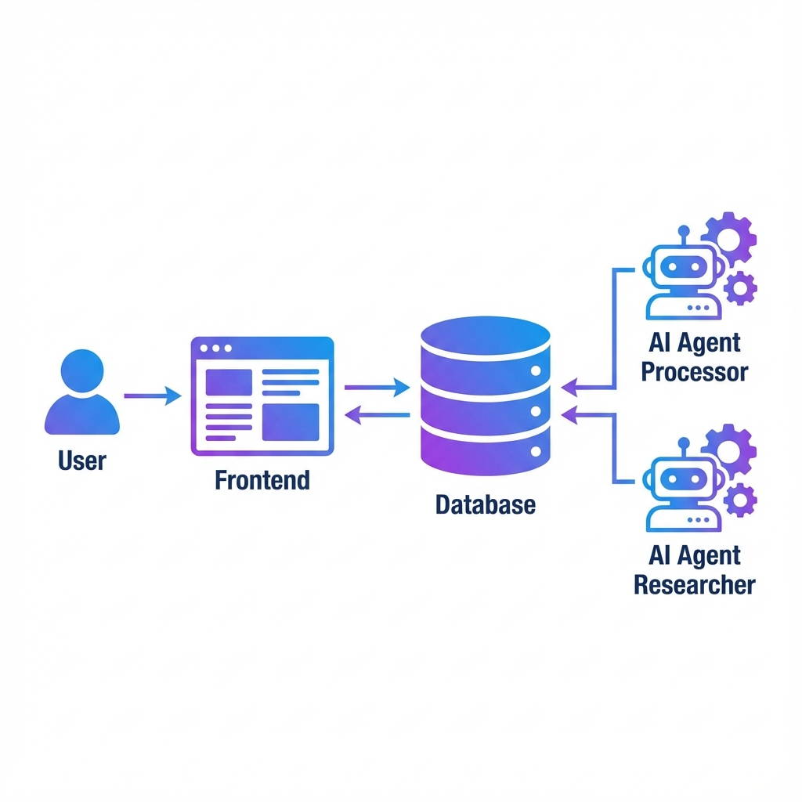

# HR GenAI Application

A next-generation Applicant Tracking System (ATS) powered by Autonomous AI Agents. This application leverages advanced Large Language Models (LLMs) and specialized workflows to automate resume screening, candidate background research, and technical evaluation, providing recruiters with intelligent, data-driven insights.

---

## 🚀 Executive Summary

The **HR GenAI Application** transforms the traditional recruitment process by deploying a fleet of AI workers to handle the heavy lifting of candidate evaluation. Unlike standard keyword-matching ATS, this system deeply "reads" resumes using computer vision-powered parsing, verifies claims by browsing the web (GitHub, Portfolios), and provides a comprehensive, scored analysis for every applicant.

**Key capabilities include:**
- **Automated Screening:** Intelligent parsing and scoring relative to job descriptions.
- **Autonomous Research:** AI agents actively browse and verify candidate links.
- **Real-Time Monitoring:** Live dashboard tracking agent activities and metrics.
- **Scalable Architecture:** Microservices-based design deployed on Azure Container Apps.

---

## 🏗️ High-Level Architecture

The system is built on a modern microservices architecture, separating the user interface from the intensive AI processing tasks.



---

## ✨ Key Features

### 1. Unified Recruiter Dashboard
- **Job Management:** Create and track job openings with specific requirements.
- **Candidate Pipeline:** Kanban-style view of applicants through various stages.
- **Chat with Candidate:** RAG-powered chatbot allowing recruiters to "chat" with a candidate's resume to ask specific questions (e.g., "Does this candidate have React experience?").

### 2. Autonomous "Processor" Agent
- **Event-Driven:** Automatically activates when a new application is submitted.
- **Advanced Parsing:** Uses **LlamaParse** to extract structured data from complex PDF layouts.
- **Contextual Analysis:** Performs Retrieval-Augmented Generation (RAG) to compare skills against the specific job description.
- **Scoring Engine:** Generates a preliminary suitability score (0-100) based on skills and evidence.

### 3. Autonomous "Researcher" Agent
- **Agentic Workflow:** Built with **LangGraph** to execute multi-step research plans.
- **Web Browsing:** Visits extracted links (GitHub, Personal Sites, LinkedIn) using **Puppeteer**.
- **Verification:** Summarizes external content to validate years of experience and project complexity.
- **Anti-Bot Handling:** Smartly handles different site types (static sites vs. protected platforms).

### 4. Mission Control Monitoring
- **Real-Time Ops:** View live logs of agent activities (tokens used, duration, success/failure).
- **Performance Metrics:** Track average processing time, total applications processed, and error rates directly from the admin interface.

---

## 🛠️ Technology Stack

### Frontend Application
- **Framework:** Next.js 16 (App Router)
- **UI Component:** React 19, Tailwind CSS, Lucide React
- **Data Visualization:** Recharts
- **Authentication:** NextAuth.js

### AI & Backend Services
- **Runtime:** Node.js (TypeScript)
- **AI Orchestration:** LangChain, LangGraph
- **LLM Provider:** Groq (Llama 3.3 70B Versatile)
- **Document Parsing:** LlamaParse (LlamaIndex)
- **Browser Automation:** Puppeteer
- **Database:** MongoDB (Mongoose)

### Infrastructure & DevOps
- **Cloud Provider:** Microsoft Azure
- **Compute:** Azure Container Apps (Serverless Containers)
- **Registry:** Azure Container Registry (ACR)
- **CI/CD:** GitHub Actions (Automated Build & Deploy)
- **Monitoring:** Custom MongoDB-based Logging & Metrics

---

## 🔄 Operational Workflow

1.  **Submission:** A candidate submits an application via the portal. The resume is stored, and the status is set to `new`.
2.  **Processing (Stage 1):** The **Processor Agent** detects the new entry via MongoDB Change Streams.
    *   It fetches and parses the PDF.
    *   It extracts key skills, contact info, and links.
    *   It calculates a preliminary "Match Score".
    *   Status updates to `reviewed`.
3.  **Research (Stage 2):** If valid links are found, the **Researcher Agent** is triggered.
    *   It visits each link (GitHub, Portfolio).
    *   It analyzes the content to verify technical depth.
    *   It appends a "Research Summary" to the candidate profile.
4.  **Decision:** The recruiter reviews the consolidated profile, including the AI reasoning and research notes, to make an informed decision (Interview/Reject).

---

## 🚀 Getting Started

### Prerequisites
- Node.js v20+
- MongoDB Atlas Instance
- API Keys: Groq, LlamaParse

### Local Development

1.  **Clone the Repository**
    ```bash
    git clone https://github.com/Ferasman979/HRApp.git
    cd HRApp
    ```

2.  **Setup Frontend**
    ```bash
    cd nextjs-hrapp-project
    npm install
    cp .env.example .env.local # Configure keys
    npm run dev
    ```

3.  **Setup AI Agents**
    ```bash
    cd ../hr-agent-mcp
    npm install
    cp .env.example .env # Configure keys
    npm run worker    # Starts the Processor
    # In a separate terminal
    npm run research  # Starts the Researcher
    ```

### Deployment
The project includes a full CI/CD pipeline using **GitHub Actions**. Pushing to the `main` or `dev` branch triggers:
1.  Docker build of Frontend and Agent images.
2.  Push to Azure Container Registry.
3.  Zero-downtime deployment to Azure Container Apps.

### Infrastructure as Code (Terraform)
We utilize **Terraform** to programmatically manage external resources, ensuring reproducible and consistent environments for the external "Easy Apply" microsite.

**Managed Resources:**
-   **Vercel:** Auto-deploy configuration for the Next.js frontend functions and edge networks.
-   **MongoDB Atlas:** Provisioning of serverless database clusters, users, and network access lists.

**Usage:**
```bash
cd easy-apply-site/terraform
# Initialize providers
terraform init

# Preview changes
terraform plan -var-file="prod.tfvars"

# Apply infrastructure changes
terraform apply -var-file="prod.tfvars"
```

---

**Developed by Feras**
